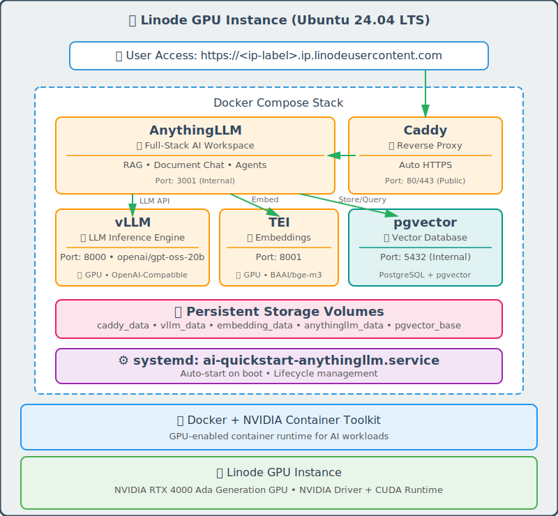

# Akamai Cloud - AI Quickstart : RAG Stack with AnythingLLM

Automated deployment script to run your private, self-hosted AI workspace on Akamai Cloud GPU instances. This stack combines vLLM for high-performance LLM inference with AnythingLLM - a full-stack application for building private AI assistants with RAG (Retrieval Augmented Generation), document chat, and agent capabilities.

-----------------------------------------
## 🚀 Quick Start

Just run this single command:

```bash
curl -fsSL https://raw.githubusercontent.com/linode/ai-quickstart-anythingllm/main/deploy.sh | bash
```

That's it! The script will download required files and guide you through the interactive deployment process.

## ✨ Features
- **Fully Automated Deployment**: Handles instance creation with real-time progress tracking
- **Ready to use AI Stack**: vLLM for GPU-accelerated inference + AnythingLLM for enterprise AI workspace
- **RAG & Document Chat**: Upload documents and chat with your data using AnythingLLM's built-in vector database
- **AI Agents**: Build custom AI agents with tools and workflows
- **Cross-Platform Support**: Works on macOS, Linux, and Windows (Git Bash/WSL)

-----------------------------------------

## 🏗️ What Gets Deployed



<br clear="left"/>

### Linode GPU Instance with
- Ubuntu 24.04 LTS with NVIDIA drivers
- Docker & NVIDIA Container Toolkit
- Systemd service for automatic startup on reboot

### Docker Containers
| | Service | Description |
|:--:|:--|:--|
|  | **vLLM** | High-throughput LLM inference engine with OpenAI-compatible API (port 8000, internal) |
|  | **Text Embeddings Inference** | GPU-accelerated embedding service using BAAI/bge-m3 model (port 8001, internal) |
|  | **pgvector** | PostgreSQL with vector similarity search extension for RAG storage (port 5432, internal) |
|  | **AnythingLLM** | Full-stack AI application with RAG, document chat, agents, and multi-user support (port 3001) |

### What is AnythingLLM?
[AnythingLLM](https://anythingllm.com/) is an open-source, full-stack application that turns any document, resource, or content into context for any LLM. Key features include:
- **Document Intelligence**: Upload PDFs, Word docs, websites, and more - chat with your data instantly
- **Vector Database**: Uses pgvector (PostgreSQL) for scalable, production-grade vector storage
- **Multi-user Workspaces**: Create isolated workspaces for different projects or teams
- **AI Agents**: Build custom agents with browsing, code execution, and RAG capabilities
- **Privacy-First**: All data stays on your infrastructure - nothing leaves your server

### RAG Pipeline Components
This deployment includes a complete RAG (Retrieval Augmented Generation) pipeline:
- **Text Embeddings Inference**: Hugging Face's [TEI](https://github.com/huggingface/text-embeddings-inference) service running the [BAAI/bge-m3](https://huggingface.co/BAAI/bge-m3) multilingual embedding model
- **pgvector**: PostgreSQL extension for efficient vector similarity search, enabling fast document retrieval at scale

-----------------------------------------

## 📋 Requirements

### Akamai Cloud Account
- Active Linode account with GPU access enabled

### Local System Requirements
- **Required**: bash, curl, ssh, jq
- **Note**: jq will be auto-installed if missing

-----------------------------------------
## 🚦 Getting Started

### 1. Option A: Single Command Execution

No installation required - just run:

```bash
curl -fsSL https://raw.githubusercontent.com/linode/ai-quickstart-anythingllm/main/deploy.sh | bash
```

### 1. Option B: Download and Run

Download the script and run locally:

```bash
curl -fsSLO https://raw.githubusercontent.com/linode/ai-quickstart-anythingllm/main/deploy.sh
bash deploy.sh
```

### 1. Option C: Clone Repository

If you prefer to inspect or customize the scripts:

```bash
git clone https://github.com/linode/ai-quickstart-anythingllm
cd ai-quickstart-anythingllm
./deploy.sh
```

> [!NOTE]
> if you like to add more services check out docker compose template file
> ```
> vi /template/docker-compose.yml
> ```
>

### 2. Follow Interactive Prompts
The script will ask you to:
- Choose a region (e.g., us-east, eu-west)
- Select GPU instance type
- Provide instance label
- Select or generate SSH keys
- Confirm deployment

### 3. Wait for Deployment
The script automatically:
- Creates GPU instance in your Linode account
- Monitors cloud-init installation progress
- Waits for AnythingLLM health check
- Waits for vLLM model loading

### 4. Access Your Services
Once complete, you'll see:
```
🎉 Setup Complete!

✅ Your AI LLM instance is now running!

🌐 Access URLs:
   AnythingLLM:  http://<instance-ip>:3001

🔐 Access Credentials:
   SSH:   ssh -i /path/to/your/key root@<instance-ip>
```

### Configuration files in GPU Instance
```
   # Install script called by cloud-init service
   /opt/ai-quickstart-anythingllm/install.sh

   # docker compose file calle by systemctl at startup
   /opt/ai-quickstart-anythingllm/docker-compose.yml

   # service definition
   /etc/systemd/system/ai-quickstart-anythingllm.service
```

-----------------------------------------

## 🗑️ Delete Instance

To delete a deployed instance:

```bash
# Remote execution
curl -fsSL https://raw.githubusercontent.com/linode/ai-quickstart-anythingllm/main/delete.sh | bash -s -- <instance_id>

# Or download script and run
curl -fsSLO https://raw.githubusercontent.com/linode/ai-quickstart-anythingllm/main/delete.sh
bash delete.sh <instance_id>
```

The script will show instance details and ask for confirmation before deletion.

-----------------------------------------

## 📁 Project Structure

```
ai-quickstart-anythingllm/
├── deploy.sh                    # Main deployment script
├── delete.sh                    # Instance deletion script
├── script/
│   └── quickstart_tools.sh      # Shared functions (API, OAuth, utilities)
└── template/
    ├── cloud-init.yaml          # Cloud-init configuration
    ├── docker-compose.yml       # Docker Compose configuration
    └── install.sh               # Post-boot installation script
```

-----------------------------------------
## 🔒 Security

**⚠️ IMPORTANT**: By default, port 3001 (AnythingLLM) is exposed to the internet

### Immediate Security Steps

1. **Configure Cloud Firewall** (Recommended)
   - Create Linode Cloud Firewall
   - Restrict access to port 3001 by source IP
   - Allow SSH (port 22) from trusted IPs only

2. **SSH Security**
   - SSH key authentication required
   - Root password provided for emergency console access only

-----------------------------------------
## 🛠️ Useful Commands

```bash
# SSH into your instance
ssh -i /path/to/your/key root@<instance-ip>

# Check container status
docker ps -a

# Check Docker containers log
cd /opt/ai-quickstart-anythingllm && docker compose logs -f

# Check systemd service status
systemctl status ai-quickstart-anythingllm.service

# View systemd service logs
journalctl -u ai-quickstart-anythingllm.service -n 100

# Check cloud-init logs
tail -f /var/log/cloud-init-output.log -n 100

# Restart all services
systemctl restart ai-quickstart-anythingllm.service

# Check NVIDIA GPU status
nvidia-smi

# Check vLLM loaded models
curl http://localhost:8000/v1/models

# Check AnythingLLM health
curl http://localhost:3001/api/ping

# Check container logs
docker logs vllm
docker logs anythingllm
docker logs embedding
docker logs pgvector

# Check embedding service health
curl http://localhost:8001/health

# Check pgvector status
docker exec pgvector pg_isready -U anythingllm
```

## 🤝 Contributing

Issues and pull requests are welcome! For major changes, please open an issue first to discuss what you would like to change.

## 📄 License

This project is licensed under the Apache License 2.0.

